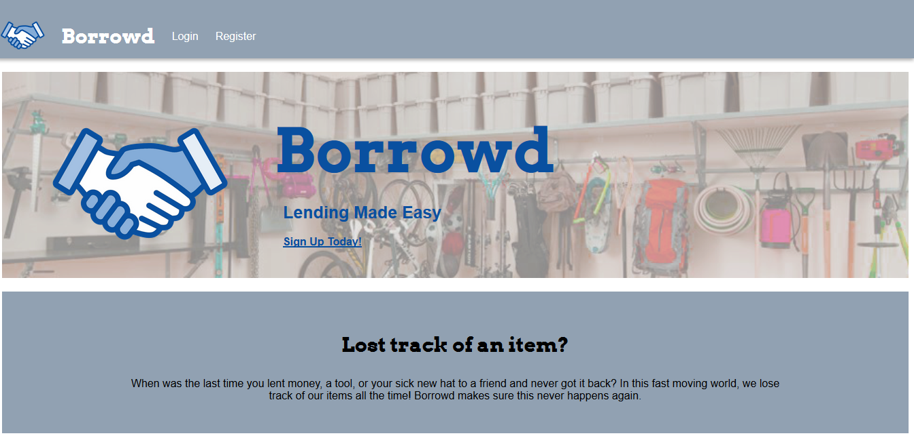
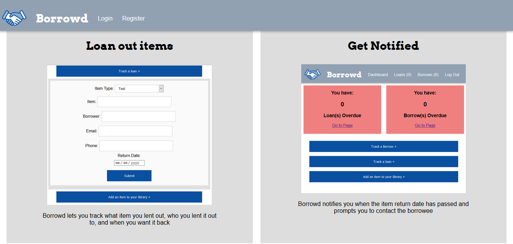
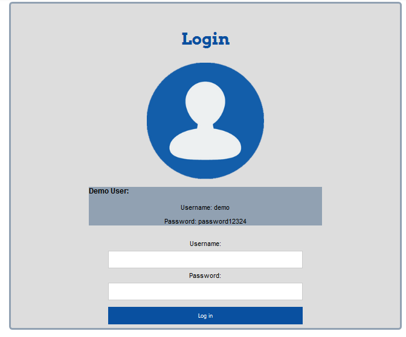
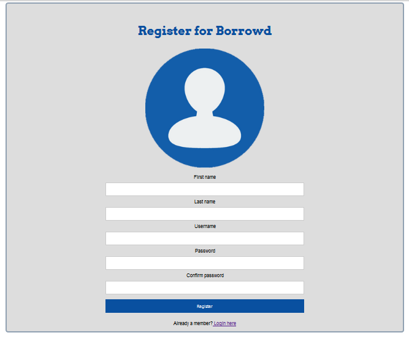
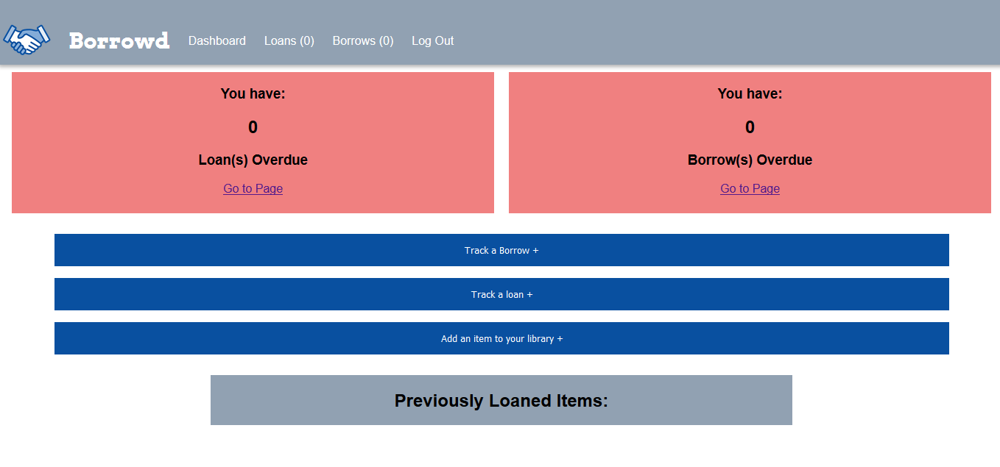
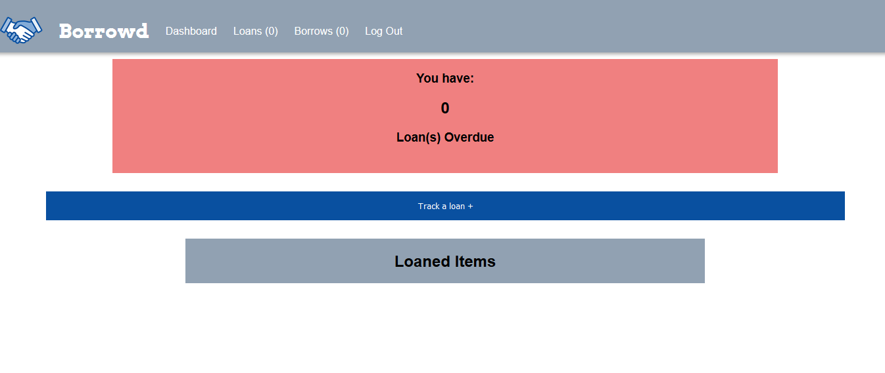
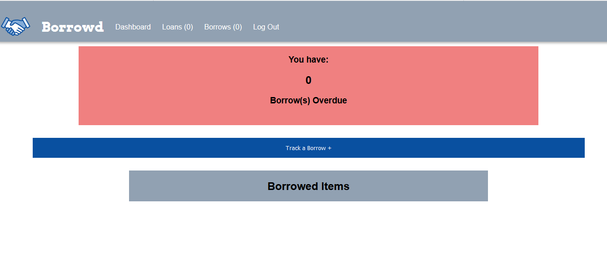

# Borrowd

# Summary
Do you ever lend something out and then a week later need that item and don't remember where it is? That's why I created Borrowd. Borrowd is an all in one website that allows you to track your loans and borrows. It notifies you in app when your borrowed or loaned item is overdue. Borrowd also has a library of items that have been loaned in the past for easy loaning access. Users can return items, renew items, and track those items via a sorted list. 

# Demo
Live app: https://infinite-river-85875.herokuapp.com/  
Live API: https://whispering-brook-49128.herokuapp.com/  
API Github: https://github.com/jkathan/borrowd-api-final  

# Screenshots
Borrowd landing page:
  
Borrowd landing page (cont):
  
Login Page:
  
Registration Page:
  
Dashboard:
  
Loan Page:
  
Borrow Page:
  

# Technologies Used
React, Node, Express, JQuery, JavaScript, MongoDB, Mongoose, Mocha, Chai, REST APIs

# Restful API

## GET
- /get/:newId -> Retrieves userboard by id
- /auth/login -> ensures user is in user database upon login

## POST
 - /post -> Creates a new board on registration
 -/users -> Post new user to user database

## PUT
- /put/:newId -> Updates user board

# Future Enhancements
- Updating testing. Due to some pecularities between my API and react, my data came in a way that made it challenging for me to test. I will be working with my mentor to update these tests in the coming weeks. 
- Allow for searches by other  parameters
- Allow for search of all pages
- Integrate push notifications on a react native app. Integrate calender notifications. 
